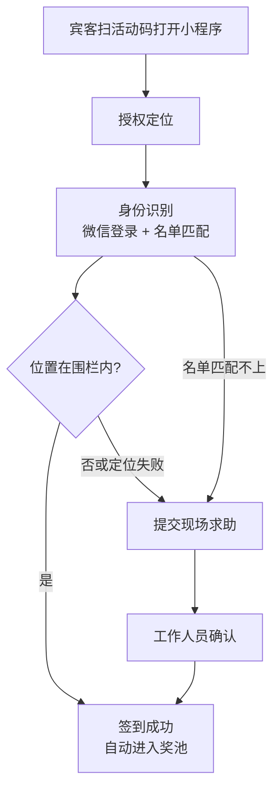
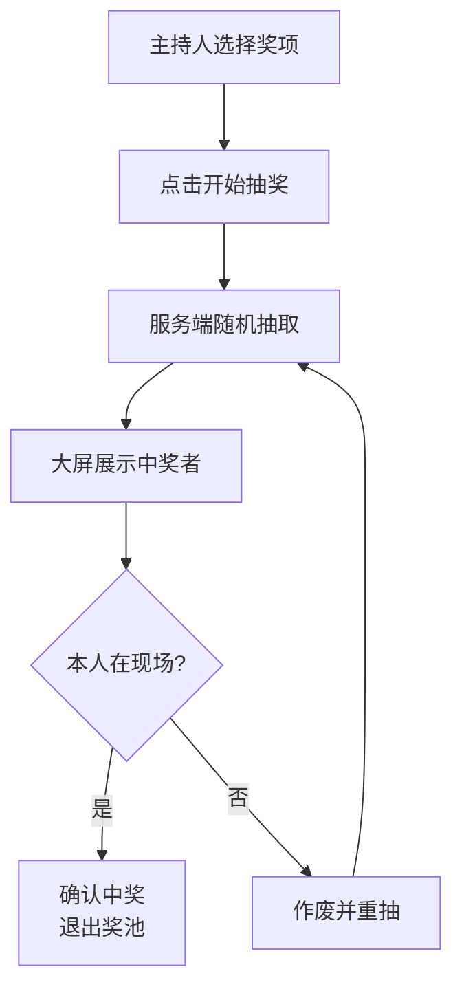

# 定位签到抽奖 · 产品需求

## 1. 背景与目标

本产品是面向线下活动的多租户 SaaS：组织方可自助创建活动，宾客通过微信小程序在设定地理围栏内完成签到并进入奖池，主持人在电脑大屏完成可追溯的现场抽奖。

**产品定位**：以「定位围栏签到 + 服务端随机抽奖」为差异化能力，按活动场次售卖；首发场景是企业年会，可扩展到发布会、经销商大会、线下沙龙。

**目标**

- 组织方：自助开活动、导入名单、配置围栏与奖项，无需技术介入即可完成一场签到抽奖。
- 宾客：入场高峰内快速签到；定位签到模式下人不在活动围栏内不能签到。
- 抽奖：仅已签到者入池，结果随机、公平、可追溯。
- 现场：主持人用一台电脑控制大屏；网络异常时有兜底方案。

**成功标准（建议值）**

| 指标 | 目标 |
| --- | --- |
| 组织方创建并配置一场活动 | ≤ 30 分钟（含导入名单） |
| 单人签到耗时 | ≤ 10 秒 |
| 定位自动通过率 | ≥ 95%，其余走人工确认 |
| 单场 800 人集中签到 | 30 分钟内无系统故障 |
| 单轮抽奖出结果 | ≤ 3 秒 |
| 活动结束后数据 | 组织方可自助导出签到名单与中奖记录 |

**明确不做（首发）**

- 微信第三方平台代生成独立小程序 / 白标 App。
- 人脸识别、蓝牙信标等更强到场验证。
- 红包、支付分账、弹幕、互动小游戏、议程票务等会务套件。
- 按组织分库分实例的强隔离部署。
- 复杂在线计费与自动开票（首发可用手动开通场次）。

## 2. 产品形态与分发

**结论**：采用「平台单小程序 + Web 控制台 + 活动码入场」。

| 决策 | 选择 | 理由 |
| --- | --- | --- |
| 小程序分发 | 一个官方小程序承载全部客户 | 避免一客户一小程序的审核与代开发成本，最快验证付费 |
| 宾客入场 | 扫活动码进入，绑定到指定 `event` | 同一微信可参加多场；活动之间数据隔离 |
| 组织方入口 | Web 控制台 | 导入 Excel、配奖项、导出数据更适合桌面操作 |
| 大屏入口 | 活动专属链接 + 主持人口令 | 禁止跨活动操作；刷新可恢复状态 |
| 计费 | 按场次开通（可叠加人数档位） | 年会季节性强，按场次比纯年费更贴合采购 |

**触发切换条件**：若头部客户强依赖自有小程序品牌，再单独立项接入微信第三方平台；不在首发范围混入。

## 3. 角色与使用场景

系统有平台侧与活动侧两类角色。宾客与现场工作人员用小程序；组织管理员与主持人用 Web；平台运营用内部后台。

| 角色 | 典型人数 | 使用入口 | 主要诉求 |
| --- | --- | --- | --- |
| 宾客 | 单场约数百至上千 | 平台小程序 | 到场快速签到，查看是否入池、是否中奖 |
| 现场工作人员 | 单场 3～5 | 小程序管理入口 | 处理定位失败，代为确认签到，看签到进度 |
| 组织管理员 | 每组织 1～3 | Web 控制台 | 开通/创建活动，导入名单，设围栏与奖项，导出数据 |
| 主持人 | 单场 1 | 电脑浏览器大屏页 | 控制抽奖节奏，展示结果，处理缺席重抽 |
| 平台运营 | 内部 | 运营后台 | 开通组织与场次配额，处理异常租户，查看平台用量 |

**典型场景**

- 运营开通组织后，组织管理员登录控制台，创建「2026 年会」活动，导入 800 人名单，地图上选酒店中心点并设半径 400 米，配置三等奖到特等奖。
- 宾客到酒店门口扫活动码，授权定位后点签到，几秒内看到成功。
- 宾客在地下宴会厅 GPS 偏差大，系统引导提交人工确认，工作人员在小程序里一键通过。
- 主持人打开大屏链接，点开始抽奖，大屏滚动后定格；中奖人不在场则作废重抽。

## 4. 核心业务流程

活动生命周期为：开通组织与场次 → 配置活动 → 现场签到 → 现场抽奖 → 导出与清理。

**活动前（组织管理员）**

1. 使用运营开通的账号登录组织控制台，确认可用场次配额。
2. 创建活动草稿（不扣场次），填写名称与签到时间窗。
3. 导入参会名单（姓名 + 手机号后四位，可选部门），可逐条增删改；在地图上选定中心点与半径。
4. 录入奖项与抽取顺序；邀请现场工作人员。
5. 将活动设为就绪（首次就绪扣 1 场次）；下载活动码。
6. 用测试账号跑通签到与抽奖，签到开始前重置现场数据。

**现场签到**



宾客首次进入需匹配该活动名单；之后再打开同一活动直接显示签到状态。直接签到模式跳过授权定位与围栏判断，见 §7。位置不在范围内、定位失败或名单匹配不上时，可提交现场求助，不会被直接永久拒绝。工作人员通过时一步完成绑定与签到。

**现场抽奖**



**活动后**：组织管理员导出签到名单、中奖记录与抽奖日志；按保留策略清理位置原始数据。

## 5. 功能需求

系统由平台小程序（宾客端 + 管理入口）、Web 控制台、大屏抽奖页、运营后台组成。P0 为可售卖最小集，P1 建议首发后尽快补，P2 可延后。

### 5.1 组织与活动（Web 控制台）

| 编号 | 功能 | 说明 | 优先级 |
| --- | --- | --- | --- |
| O1 | 组织登录 | 邮箱 + 口令登录；组织由平台运营开通，控制台不提供自助注册 | P0 |
| O2 | 场次配额展示 | 显示已开通场次、已使用、剩余；不足时提示联系开通 | P0 |
| O3 | 创建与编辑活动 | 活动名称、签到起止时间、是否允许一人兼中 | P0 |
| O4 | 活动码 | 生成进入该活动的小程序码，可下载 | P0 |
| O5 | 成员管理 | 邀请组织管理员；为活动配置现场工作人员（绑定微信后生效） | P1 |
| O6 | 复制活动模板 | 复制上场的奖项与围栏配置到新活动（不含名单与中奖数据） | P1 |
| O7 | 品牌浅定制 | 活动显示名、封面、大屏主题色 | P2 |
| O8 | 活动短链 | 用于会前短信或邮件通知宾客 | P1 |

### 5.2 宾客端小程序

| 编号 | 功能 | 说明 | 优先级 |
| --- | --- | --- | --- |
| G1 | 活动进入与身份绑定 | 经活动码进入指定活动；微信登录取得 openid；输入姓名和手机号后四位匹配该活动名单并绑定 | P0 |
| G2 | 签到 | 点击签到。定位签到模式下获取定位并由服务端校验围栏；直接签到模式下不取定位。成功即入池 | P0 |
| G3 | 签到状态 | 展示未签到、已签到、待人工确认及签到时间 | P0 |
| G4 | 定位授权引导 | 定位签到模式下拒绝授权时说明原因并引导打开设置 | P0 |
| G5 | 现场求助 | 定位失败、不在范围内或名单匹配不上时可提交申请并查看处理结果 | P0 |
| G6 | 中奖结果 | 被抽中后展示奖项与兑奖说明 | P1 |
| G7 | 中奖订阅消息 | 中奖后推送订阅消息 | P2 |
| G8 | 我的活动列表 | 同一微信参与过的活动列表（可选） | P2 |

### 5.3 管理入口（小程序内，仅工作人员与组织管理员可见）

| 编号 | 功能 | 说明 | 优先级 |
| --- | --- | --- | --- |
| M1 | 角色识别 | 按活动授权识别工作人员/管理员；无权限者不展示入口 | P0 |
| M2 | 签到进度 | 实时展示已签到、应到、待确认人数 | P0 |
| M3 | 人工确认 | 查看待处理求助，通过或拒绝并记录操作人；名单匹配不上的可关联已有人员或新增人员 | P0 |
| M4 | 代为签到 | 按姓名搜索宾客并直接代为签到 | P1 |
| M5 | 签到方式与围栏设置 | 切换签到方式；用 `wx.chooseLocation` 选中心点，输入半径。保存后立即生效 | P0 |

### 5.4 大屏抽奖页

| 编号 | 功能 | 说明 | 优先级 |
| --- | --- | --- | --- |
| D1 | 签到大屏 | 展示活动码与实时签到人数 | P0 |
| D2 | 抽奖控制 | 选择奖项，开始/停止，支持键盘快捷键 | P0 |
| D3 | 滚动动画与结果展示 | 名字滚动后定格，展示姓名与部门 | P0 |
| D4 | 缺席重抽 | 作废结果并补抽；作废记录保留 | P0 |
| D5 | 一次抽多人 | 多人结果分页展示 | P1 |
| D6 | 中奖名单总览 | 按奖项展示全部有效中奖者 | P1 |
| D7 | 断网提示 | 断开时显著提示，恢复后自动重连 | P1 |

### 5.5 活动配置与数据（Web 控制台）

| 编号 | 功能 | 说明 | 优先级 |
| --- | --- | --- | --- |
| B1 | 名单导入与维护 | 上传 Excel，校验重复与格式错误，展示导入结果；支持单条新增、修改、删除 | P0 |
| B2 | 签到方式、围栏与时间窗 | 选择定位签到或直接签到；定位签到需配置中心点与半径；配置签到起止时间 | P0 |
| B3 | 奖项配置 | 名称、奖品、人数、顺序；是否允许一人兼中在活动级配置 | P0 |
| B4 | 数据导出 | 导出签到名单、中奖名单为 Excel | P0 |
| B5 | 抽奖日志 | 查看每次抽取的时间、奖项、结果、是否作废 | P1 |
| B6 | 活动结束与清理 | 结束活动；按策略清除位置原始坐标 | P1 |
| B7 | 重置现场数据 | 签到开始前清空试跑产生的绑定、签到与中奖数据，保留名单与配置 | P0 |

### 5.6 平台运营

| 编号 | 功能 | 说明 | 优先级 |
| --- | --- | --- | --- |
| P1 | 组织开通 | 创建组织并授予场次配额与人数档位 | P0 |
| P2 | 用量查看 | 组织数、活动数、峰值签到等基础指标 | P1 |
| P3 | 自助支付与发票 | 在线购买场次、开票 | P2 |

## 6. 租户与权限规则

| 规则 | 设定 |
| --- | --- |
| 层级 | 平台 → 组织（org）→ 活动（event）→ 参会人/工作人员 |
| 数据隔离 | 共享库行级隔离；所有业务查询必须带 `org_id` / `event_id`，禁止跨组织读写 |
| 宾客绑定 | 同一 openid 可绑定多个活动的名单行；同一活动内一人只能绑一个 openid |
| 活动进入 | 无活动码上下文时，不能浏览或签到其他活动 |
| 控制台权限 | 组织管理员可管理本组织全部活动；不可见其他组织 |
| 小程序管理入口 | 仅当该用户在该活动下具有 staff/admin 授权时可见 |
| 大屏权限 | 活动级 host 凭证；SSE 与抽奖接口校验活动归属 |
| 场次配额 | 活动首次就绪消耗 1 个场次，退回草稿或结束不退还；草稿不收费；配额用尽不能就绪 |
| 人数档位 | 组织有默认名单上限，创建活动时复制到活动；运营可单独调高某场活动；超出拒绝导入与新增 |

## 7. 签到规则

签到方式是活动级设置，默认定位签到：

| 方式 | 签到条件 | 适用场景 |
| --- | --- | --- |
| 定位签到 | 已绑定名单、在时间窗内、在围栏内 | 需要证明宾客在现场 |
| 直接签到 | 已绑定名单、在时间窗内 | 地下或封闭场馆定位普遍漂移；内部活动不关心远程签到；宾客不愿授权定位 |

| 规则 | 设定 |
| --- | --- |
| 签到动作 | 两种方式都需要宾客点击签到；绑定名单不等于签到，宾客可能在会前完成绑定 |
| 切换时机 | 组织管理员或现场管理员随时可切换，立即生效；已签到记录不受影响 |
| 待处理求助 | 切到直接签到后仍然有效；已绑定的宾客也可以自己重新签到 |
| 隐私 | 直接签到模式不调用定位，不记录坐标；导出标注「直接签到」 |
| 代价提示 | 选择直接签到时明确提示：宾客不在现场也能签到，奖池可能包含缺席者，需依靠现场缺席重抽 |

以下规则只适用于定位签到。签到是否通过完全由服务端判定：小程序只上报坐标和精度，服务端用距离减去定位精度后与半径比较。

先用 Haversine 计算宾客到活动中心点的球面距离 d，再判断：

```latex
d = 2r\arcsin\sqrt{\sin^2\frac{\varphi_2-\varphi_1}{2}+\cos\varphi_1\cos\varphi_2\sin^2\frac{\lambda_2-\lambda_1}{2}}
```

```latex
d - \min(a,\ 200) \le R
```

其中 r 为地球半径，φ 为纬度，λ 为经度，a 为上报精度（米），R 为半径（米）。精度抵扣上限 200 米。

| 规则 | 设定 |
| --- | --- |
| 坐标系 | GCJ-02。小程序 `wx.getLocation` 使用 gcj02；控制台选点同为 GCJ-02 |
| 默认半径 | 400 米；管理员可在 100～1000 米调整，保存后立即生效 |
| 定位精度过差 | 精度大于 500 米时提示重试一次，仍过差则转人工确认 |
| 签到时间窗 | 由活动配置；窗口外提示未开放或已结束 |
| 重复签到 | 同一活动名单人员只能签到一次；重复点击返回已签到状态 |
| 一人多号 | 同一活动名单人员只能绑定一个 openid；第二个微信号绑定被拒绝 |
| 授权被拒 | 引导开启定位；仍无法获取时转人工确认 |
| 人工确认 | 工作人员通过后视为已签到；导出标注「人工确认」与操作人。名单匹配不上的宾客同样走此流程 |
| 记录留存 | 每次尝试记录经纬度、精度、距离、结果、时间；成败都保留 |

**已知限制**：室内或地下场地可能偏差几十到一百多米，半径不宜过小。改定位软件仍可能绕过围栏；首发依靠现场人员与人工确认约束。

## 8. 抽奖规则

每次抽奖从「该活动已签到且尚未中奖」的人中由服务端随机抽取；中奖者默认退出后续奖池；所有结果留痕。

| 规则 | 设定 |
| --- | --- |
| 奖池范围 | 状态为已签到（含人工确认）的人 |
| 实时入池 | 迟到签到成功后立刻入池，下一次抽取生效 |
| 随机方式 | 服务端加密级随机数（Go `crypto/rand`）；前端动画不决定结果 |
| 一人一奖 | 默认一人只能中一次；是否允许兼中由活动级开关 `allow_multi_win` 决定 |
| 奖项与顺序 | 名称、奖品、人数、顺序由组织管理员配置 |
| 单次抽取人数 | 可抽 1 人或多人；多人在服务端一次抽完，大屏分页展示 |
| 缺席重抽 | 作废该结果后补抽；被作废者不再参与本奖项，仍可参与后续奖项；作废前后记录都保留 |
| 冻结奖池 | 某一轮开始抽取后，本轮奖池快照不再变化 |
| 结果不可篡改 | 已确认结果不能直接改写，只能作废后产生新记录 |
| 抽奖日志 | 记录时间、奖项、奖池人数、结果、操作人、是否作废 |

**公平性**：不提供指定中奖人入口；事后可通过抽奖日志复盘。

## 9. 非功能需求

| 类别 | 要求 |
| --- | --- |
| 并发 | 单场签到接口按 100 请求/秒设计；多场并行时按租户限流，避免单场打满共享资源 |
| 响应时间 | 签到接口服务端处理 P95 ≤ 1 秒（不含手机定位耗时） |
| 弱网 | 小程序请求超时 8 秒，失败自动重试 1 次；签到与抽奖写接口幂等 |
| 现场网络 | 产品内提示宾客优先用手机流量；主持人使用独立稳定网络 |
| 大屏稳定性 | 结果先落库再展示；断线自动重连；刷新后恢复当前状态 |
| 接口安全 | 全站 HTTPS；管理与抽奖接口做角色与活动归属校验；签到按 openid 限流（每分钟 ≤ 10 次） |
| 租户安全 | 所有查询强制组织/活动范围；越权访问返回统一错误码 |
| 隐私合规 | 小程序隐私指引声明收集位置与姓名；仅在定位签到模式下、用户点击签到时取一次定位 |
| 数据保留 | 位置原始坐标默认活动结束后 30 天删除（合同可另行约定，组织可缩短）；名单与中奖结果按组织要求导出后处理 |
| 备份与兜底 | 定期备份；组织可随时导出签到名单；提供单机 HTML 离线抽奖兜底页 |
| 兼容性 | iOS / Android 主流微信；大屏支持最新 Chrome / Edge，按 1920×1080 设计 |

## 10. 数据与统计

| 数据 | 关键字段 |
| --- | --- |
| 组织 | 名称、联系人、场次配额、人数档位、状态 |
| 活动 | 所属组织、名称、签到方式、中心点、半径、签到时间窗、是否允许兼中、状态 |
| 参会人员 | 活动、姓名、部门、手机号后四位、绑定 openid、签到状态、签到时间、签到方式、签到操作人 |
| 签到尝试 | 活动、人员、openid、经纬度、精度、距离、结果、失败原因、时间 |
| 现场求助 | 提交人微信、人员（可空）、申报姓名与后四位、原因、状态、处理人、处理时间 |
| 奖项 | 活动、名称、奖品、人数、顺序 |
| 中奖记录 | 奖项、人员、抽取时间、状态（有效/作废）、作废原因 |
| 抽奖日志 | 奖项、奖池人数、操作人、时间、结果 |
| 成员授权 | 组织或活动级角色（org_admin / staff / host） |

**实时统计**：应到、已签到、待确认、签到率（管理入口与大屏）。

**导出文件（Excel）**

- 签到名单：全部参会人及状态、时间、方式
- 签到尝试明细：含坐标、精度、距离（仅组织管理员）
- 中奖名单：按奖项列出有效中奖者；作废单独标注
- 抽奖日志：完整抽取流水

## 11. 商业套餐（首发草案）

| 档位 | 场次 | 单场人数上限 | 说明 |
| --- | --- | --- | --- |
| 体验 | 1 | 100 | 用于售前演示与小规模试跑 |
| 标准 | 按次购买 | 800 | 覆盖典型年会 |
| 加量 | 按次购买 | 2000 | 大型年会或展会分会场 |

首发不强制在线支付：平台运营为组织开通配额即可开卖；P2 再接自助购买。

## 12. 风险与里程碑

**主要风险**

| 风险 | 影响 | 应对 |
| --- | --- | --- |
| 定位接口权限或类目不符 | 平台小程序无法定位 | 用平台主体尽早申请并验证类目 |
| 域名备案与 HTTPS | 正式版无法请求后端 | 启动即配置备案域名与证书 |
| 室内定位偏差 | 真人被挡在围栏外 | 默认 400 米、精度抵扣、人工确认、活动前实测 |
| 共享小程序品牌弱 | 大客户要求独立品牌 | 首发接受；达触发条件再做第三方平台 |
| 季节性订单波动 | 淡季收入低 | 扩展发布会/沙龙场景；按场次而非纯年费 |
| 租户数据串扰 | 安全与合规事故 | 行级隔离、跨组织越权测试、关键操作留痕（配额流水、人工确认、抽奖日志） |
| 现场系统故障 | 抽奖中断 | 导出名单 + 离线兜底页 + 活动前备份 |

**实施计划**：阶段划分与门禁见 [phases/README.md](phases/README.md)。备案、小程序类目与定位接口权限不受阶段门禁约束，在 [ROADMAP.md](ROADMAP.md) 单独登记并尽早启动。
